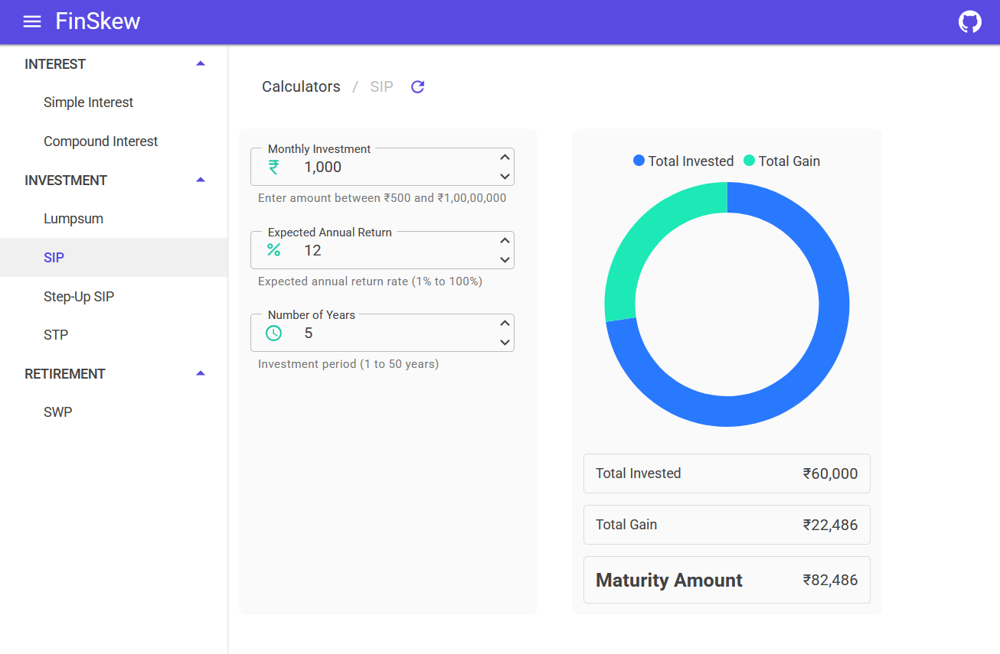

# FinSkew: Your Financial Calculators

<!-- Status Badges -->
[](https://github.com/mithunshanbhag/finskew/actions/workflows/deploy.yml)




## Installation

<!-- TODO: Add installation instructions here once deployment/distribution method is finalized -->

Installation instructions coming soon.

## Usage

FinSkew is a Blazor WebAssembly application that provides various financial calculators and tools. Once running, you can:

1. Navigate to the application in your web browser (default: `http://localhost:5000`)
2. The root route (`/`) opens the landing page; pick a calculator from the landing cards or the main menu
3. Enter your financial parameters into the calculator forms
4. View calculated results and visualizations

## Build and Run Locally

### Prerequisites

- [.NET 10.0 SDK](https://dotnet.microsoft.com/download/dotnet/10.0) or later

### Steps

1. Clone the repository:

   ```bash
   git clone https://github.com/mithunshanbhag/finskew.git
   cd finskew
   ```

2. Restore dependencies:

   ```bash
   dotnet restore
   ```

3. Build the project:

   ```bash
   dotnet build
   ```

4. Run the application:

   ```powershell
   dotnet run --project .\src\FinSkew.Ui\FinSkew.Ui.csproj
   ```

   Or use the convenience script:

   ```powershell
   .\run-local.ps1
   ```

5. Open your browser and navigate to the URL displayed in the console (typically `http://localhost:5000`), where the root route (`/`) loads the landing page

6. Optionally, run the tests:

   ```powershell
   dotnet test .\tests\FinSkew.Ui.UnitTests\FinSkew.Ui.UnitTests.csproj
   dotnet test .\tests\FinSkew.Ui.E2ETests\FinSkew.Ui.E2ETests.csproj
   dotnet test .\FinSkew.slnx
   ```

   Or use the convenience script:

   ```powershell
   - `.\run-local.ps1 unit-tests`
   - `.\run-local.ps1 e2e-tests`
   - `.\run-local.ps1 tests`
   ```
