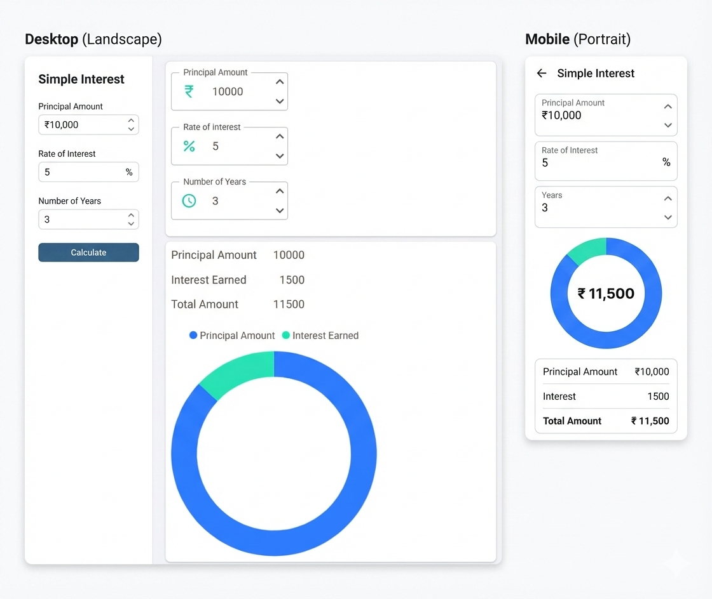
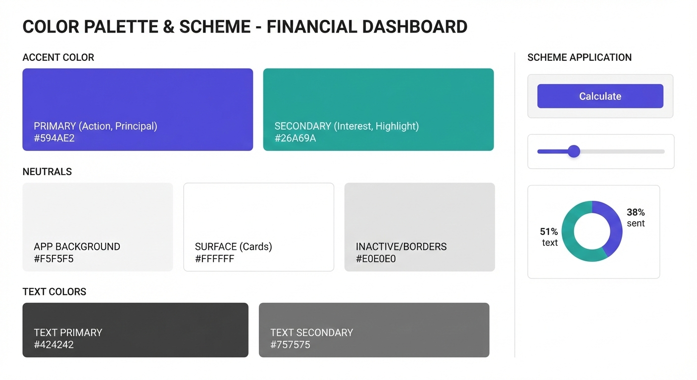
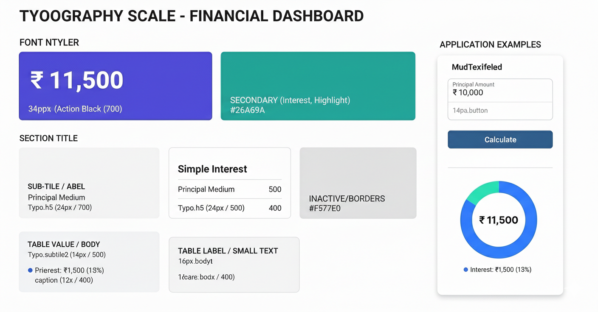

# Common UI elements and layout

## App bar

- The app will use a top **app bar** (compact/dense to maximize content area) with the following elements:
  - A **hamburger menu icon** on the far left to toggle the navigation drawer.
  - The "FinSkew" logo/text next to it, with a tooltip ("Your financial calculators") on hover.
  - A GitHub icon positioned on the extreme right. Clicking this icon will open the [FinSkew GitHub repository](https://github.com/mithunshanbhag/finskew) in a new tab.

## Navigation drawer

- A left-side **responsive navigation drawer** will contain various "sections" (e.g. Interest calculators, Investment calculators), and each section will have its own set of calculators.
  - On **desktop**, the drawer is expanded by default and can be toggled (collapsed/expanded) via the hamburger menu icon in the app bar.
  - On **mobile/tablet**, the drawer automatically collapses and functions as an overlay when opened.
- There won't be a separate "home page" or "landing page". Instead, the app will directly open to the first calculator (the simple interest calculator) when accessed. Users can then navigate to other calculators using the navigation drawer.

## Navigation aids

- Each calculator page displays a **breadcrumb trail** at the top (e.g. "Calculators > Simple Interest") for contextual orientation.
- A **scroll-to-top floating button** appears when the user scrolls down, allowing quick return to the top of the page.
- Each page sets a descriptive **browser tab title** matching the calculator name (e.g. "Simple Interest Calculator").
- **Tooltips** provide contextual hints on interactive elements (e.g. the app logo, action buttons).

## Loading and error states

- A **loading spinner** with a progress indicator is displayed while the application initially loads (i.e. during the WebAssembly download).
- An **error notification bar** appears at the bottom of the screen if an unhandled error occurs, with options to reload or dismiss.

## Calculator layout

Each calculator will have a consistent layout, with an input fields section on the left and results section on the right.

### Input fields

- There won't be a "Calculate" or "Submit" button. Instead, the results will update in **real-time with debouncing** (a brief delay to avoid excessive recalculation while typing).
- Numeric input fields use an **outlined style** for visual clarity.
- Each field displays a **leading icon adornment** indicating the field's unit (e.g. ₹ symbol for currency amounts, % symbol for rates, clock icon for time periods).
- Fields enforce **min/max constraints and step increments** with immediate validation (e.g. principal amount between ₹10,000 and ₹10,00,00,000).
- For now, separate slider controls are not needed. Users can increment/decrement values using built-in "increment / decrement" buttons in the input.

### Results

- The **results section** will consist of two parts:
  - A **chart** showing the proportional breakdown of key values (e.g. principal vs. interest earned). The chart includes a legend for clarity.
  - A **summary panel** with label-value pairs for key numerical results (e.g. Principal Amount, Interest Earned, Total Amount). Currency values are formatted with the **₹ symbol** and **Indian numbering system** (as per the Assumptions section).

## Responsive design

- On **desktop**, the input fields and results sections are displayed **side-by-side** (inputs on the left, results on the right).
- On **mobile/tablet**, they should **stack vertically** (inputs on top, results below) to maintain usability.
- Charts should **resize fluidly** to fit the available width.

## Accessibility

- Interactive elements should have **descriptive tooltips** and appropriate **ARIA labels** for screen reader support.
- Color contrast should meet **WCAG AA** standards.
- All functionality should be **keyboard navigable** (tab order, focus indicators, etc.).

## Color palette

The app uses a consistent color palette that balances professionalism with visual clarity. Colors are organized into three categories: **brand**, **semantic**, and **surface**.

### Brand colors

These colors define the FinSkew identity and are used in the logo, favicon, and key accent elements.

| Role       | Hex       | RGBA                  | Usage                                               |
| ---------- | --------- | --------------------- | --------------------------------------------------- |
| Dark Navy  | `#0D2A4A` | `rgba(13,42,74,1)`    | Favicon/logo background                             |
| Blue       | `#1E88E5` | `rgba(30,136,229,1)`  | Chart bar accent, logo element                      |
| Green      | `#43A047` | `rgba(67,160,71,1)`   | Chart bar accent, logo "Skew" text                  |
| Light Blue | `#90CAF9` | `rgba(144,202,249,1)` | Chart bar accent                                    |
| White      | `#FFFFFF` | `rgba(255,255,255,1)` | Logo trend line and arrow, text on dark backgrounds |

### Accent colors

These are the primary interactive colors used throughout the application interface.

| Role      | Hex       | RGBA                 | Usage                                                                                         |
| --------- | --------- | -------------------- | --------------------------------------------------------------------------------------------- |
| Primary   | `#594AE2` | `rgba(89,74,226,1)`  | Action buttons, principal amount visualization in charts, active states, interactive elements |
| Secondary | `#26A69A` | `rgba(38,166,154,1)` | Interest/earnings highlight, secondary chart segments, complementary interactive elements     |

### Semantic colors

These colors are mapped to the accent colors and convey meaning in interactive elements and feedback.

| Role          | Mapped Hex     | Mapped RGBA           | Usage                                                                                                                                                  |
| ------------- | -------------- | --------------------- | ------------------------------------------------------------------------------------------------------------------------------------------------------ |
| **Primary**   | `#594AE2`      | `rgba(89,74,226,1)`   | App bar background, floating action buttons, breadcrumb refresh icon, scroll-to-top button. This is the dominant interactive color throughout the app. |
| **Secondary** | `#26A69A`      | `rgba(38,166,154,1)`  | Chart segments representing interest/earnings, highlights, complementary visual elements.                                                              |
| **Tertiary**  | System default | -                     | Input field adornment icons (₹, %, clock). Provides a subtle visual distinction from primary.                                                          |
| **Inherit**   | `#FFFFFF`      | `rgba(255,255,255,1)` | Icons within the app bar (hamburger menu, GitHub) inherit the app bar's text color (white on primary background).                                      |

### Surface colors

These neutral colors provide backgrounds and structure to the interface.

| Role             | Hex       | RGBA                  | Usage                                               |
| ---------------- | --------- | --------------------- | --------------------------------------------------- |
| App Background   | `#FFFFFF` | `rgba(255,255,255,1)` | Main page background, app canvas                    |
| Surfaces         | `#FFFFFF` | `rgba(255,255,255,1)` | Paper surfaces, elevated content                    |
| Cards            | `#FAFAFA` | `rgba(250,250,250,1)` | Card backgrounds (subtle off-white)                 |
| Inactive/Borders | `#E0E0E0` | `rgba(224,224,224,1)` | Borders, dividers, inactive states, subtle outlines |

### Text colors

These colors ensure readability and establish visual hierarchy for text content.

| Role           | Hex       | RGBA                  | Usage                                              |
| -------------- | --------- | --------------------- | -------------------------------------------------- |
| Text Primary   | `#424242` | `rgba(66,66,66,1)`    | Primary body text, headings, main content          |
| Text Secondary | `#757575` | `rgba(117,117,117,1)` | Labels, captions, supplementary text, descriptions |

## Typography

The app uses a **type scale** to establish a clear visual hierarchy across all calculator pages. The font family is **Roboto** (loaded from Google Fonts) with weights 300 (Light), 400 (Regular), 500 (Medium), and 700 (Bold).

### Type scale

The following type scale is applied consistently across all calculator pages:

| Element                                       | MudBlazor Style | Size/Weight          | Purpose                                                                                   |
| --------------------------------------------- | --------------- | -------------------- | ----------------------------------------------------------------------------------------- |
| **Hero number** (e.g. center of donut chart)  | Custom          | 34px / Bold (700)    | Draws the eye immediately to the most important result (e.g. ₹ 11,500 total amount).      |
| **Page title** (e.g. "Simple Interest")       | Heading 5       | 24px / Medium (500)  | Section titles and page headers. Provides clear hierarchy without being overwhelming.     |
| **Section subtitle** (e.g. subsection labels) | Heading 5       | 24px / Bold (700)    | Emphasizes important subsections when stronger hierarchy is needed.                       |
| **Table value / body text**                   | Subtitle 2      | 14px / Medium (500)  | Primary data display, table values, numeric results (e.g. ₹ 10,000).                      |
| **Table label / small text**                  | Body 1          | 16px / Regular (400) | Labels for table rows, supplementary text, descriptions (e.g. "Principal Amount").        |
| **Chart legend / captions**                   | Caption         | 12px / Regular (400) | Smallest legible size for chart legends, disclaimers, tooltips (e.g. "Interest: ₹1,500"). |

### Usage guidelines

- **Hero numbers** (34px) should be reserved exclusively for the most critical metric displayed at the center of charts — never for standard headings or body text.
- **Heading 5** (24px) with medium weight (500) is the standard for page titles and section headers. Use bold weight (700) sparingly for subsections that require additional emphasis.
- **Subtitle 2** (14px / 500) is optimized for displaying numeric values and form field content where semi-bold clarity aids scannability.
- **Body 1** (16px / 400) is the default text style for labels, descriptions, and supplementary content.
- **Caption** (12px / 400) should only be used for chart legends, footnotes, and tooltips. Ensure a minimum contrast ratio of **4.5:1** against its background to maintain legibility at small sizes.
- The **Roboto font stack** should include system fallbacks: `Roboto, "Segoe UI", Arial, sans-serif`.
- In the logo/banner SVG, the font stack is `"Segoe UI", Roboto, Arial, sans-serif` to prioritize the system font for crisp SVG rendering.
